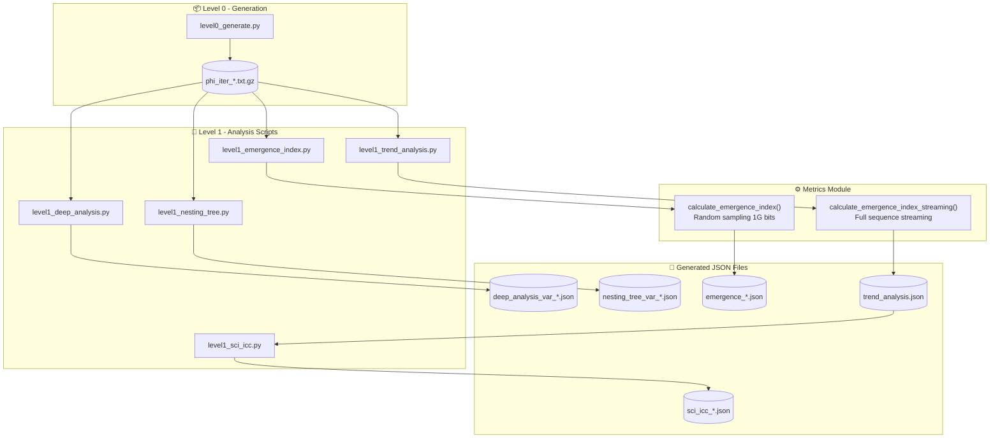

# HSI Results Data Guide

**Version:** 1.0  
**Last Updated:** 2026-01-25  
**Authors:** Iban Borràs & Sophia (Augment Agent)

---

## Overview

This document provides a comprehensive guide to the JSON result files generated by the HSI (Hipòtesi Singularitat Informacional) analysis pipeline. It is intended for researchers who need to understand the data provenance, methodology, and relationships between different analysis outputs.

---

## Data Flow Diagram



---

## Result Files Reference

### 1. Deep Analysis Files

**Location:** `results/level1/analysis/deep_analysis_var_*.json`  
**Generator:** `level1_deep_analysis.py`  
**Function:** `run_deep_analysis()`

| Field | Description |
|-------|-------------|
| `variant` | Variant code (A, B, E, F, M, L, etc.) |
| `iteration` | Iteration number |
| `wavelet` | Multi-scale wavelet entropy analysis |
| `recurrence` | Recurrence Quantification Analysis (RQA) |
| `lz_multiscale` | Lempel-Ziv complexity at multiple scales |
| `metadata.script` | Source script name |
| `metadata.generated_at` | ISO timestamp of generation |
| `metadata.max_bits_analyzed` | Number of bits analyzed |

**Key Metrics:**
- `lz_multiscale.mean_ratio`: Average LZ ratio across scales
- `lz_multiscale.best_match`: Best matching mathematical constant
- `recurrence.determinism`: Measure of predictability (0-1)
- `recurrence.recurrence_rate`: Fraction of recurrent points

---

### 2. Nesting Tree Files

**Location:** `results/level1/analysis/nesting_tree_var_*.json`  
**Generator:** `level1_nesting_tree.py`  
**Function:** `analyze_nesting_tree()`

| Field | Description |
|-------|-------------|
| `variant` | Variant code |
| `iteration` | Iteration number |
| `segments` | Array of analyzed segments |
| `segments[].tree_stats` | Tree structure statistics |
| `segments[].branching_analysis` | Branching ratio analysis |
| `metadata.script` | Source script name |
| `metadata.generated_at` | ISO timestamp |
| `metadata.segment_size` | Bits per segment |
| `metadata.num_segments` | Number of segments analyzed |

**Key Metrics:**
- `branching_analysis.mean_children`: Average branching ratio (expect φ+1 ≈ 2.618 for HSI variants)
- `tree_stats.max_depth`: Maximum tree depth
- `tree_stats.total_nodes`: Total nodes in tree

---

### 3. Emergence Index Files

**Location:** `results/level1/metrics/emergence_*.json`  
**Generator:** `level1_emergence_index.py`  
**Function:** `calculate_emergence_index()` from `metrics/emergence_index.py`

| Field | Description |
|-------|-------------|
| `emergence_index` | Composite emergence score (0-1) |
| `criticality` | 1/f spectrum analysis |
| `order` | LZ-based order score |
| `hierarchy` | Multi-scale entropy structure |
| `coherence` | Long-range mutual information |
| `metadata.script` | Source script |
| `metadata.generated_at` | ISO timestamp |

**Sampling Method (v3.0+):**
- **Sample size:** 1G bits (previously 1M)
- **Method:** Random sampling with fixed seed (42) for reproducibility
- **Rationale:** Random sampling provides statistically representative coverage

---

### 4. Trend Analysis Files

**Location:** `results/level1/trends/trend_analysis.json`  
**Generator:** `level1_trend_analysis.py`  
**Function:** `calculate_emergence_index_streaming()` from `metrics/emergence_index.py`

| Field | Description |
|-------|-------------|
| `generated` | ISO timestamp |
| `analysis_mode` | Always `streaming_full` |
| `variants` | Dictionary of variant results |
| `variants[].iterations` | Per-iteration metrics |

**Key Difference from emergence_*.json:**
- Processes the **entire sequence** via streaming (not sampling)
- More scientifically rigorous but computationally expensive
- Values may differ from sampled emergence_*.json files

---

### 5. SCI/ICC Files

**Location:** `results/level1/metrics/sci_icc_*.json`  
**Generator:** `level1_sci_icc.py`  
**Source:** Extracts data from `trend_analysis.json`

| Field | Description |
|-------|-------------|
| `source` | Always `trend_analysis.json` |
| `iterations` | Dictionary keyed by "Variant@Iteration" |
| `iterations[].sci` | Structural Complexity Index |
| `iterations[].icc` | Information Coherence Coefficient |
| `iterations[].emergence_index` | EI from streaming analysis |
| `iterations[].phi_tendency` | φ-tendency score |

---

## Emergence Index Weights (SEI - Structural Emergence Index)

Both `calculate_emergence_index()` and `calculate_emergence_index_streaming()` use identical weights:

| Component | Weight | Description |
|-----------|--------|-------------|
| **Order** | 30% | `1 - LZ_normalized` (low LZ = high order = good) |
| **Hierarchy** | 30% | Multi-scale entropy structure |
| **Coherence** | 20% | Long-range mutual information |
| **Non-randomness** | 20% | Combined DFA + Criticality score |

These weights can be customized via `config.json` → `metrics.emergence_weights`.

---

## Variant Codes Reference

| Code | Name | Description |
|------|------|-------------|
| **B** | Gold Standard | Simultaneous binary annihilation (01→0, 10→0) |
| **E** | Two-Phase | Sequential annihilation (first 01→0, then 10→0) |
| **I** | Inverse Two-Phase | Sequential annihilation (first 10→0, then 01→0) |
| **F** | Hybrid | Stratified collapse with delayed closure |
| **A** | Random Control | Mersenne Twister PRNG (control) |
| **M** | Fibonacci Control | Fibonacci word sequence (control) |
| **L** | Logistic Control | Logistic map chaotic sequence (control) |

---

## Metadata Standards

All JSON files generated after v3.0 include a `metadata` block:

```json
{
  "metadata": {
    "script": "level1_*.py",
    "generated_at": "2026-01-25T12:34:56.789012",
    "...": "additional script-specific fields"
  }
}
```

This ensures full traceability of results back to their generating scripts.

---

## Version History

| Version | Date | Changes |
|---------|------|---------|
| 1.0 | 2026-01-25 | Initial version with data flow diagram and file reference |

