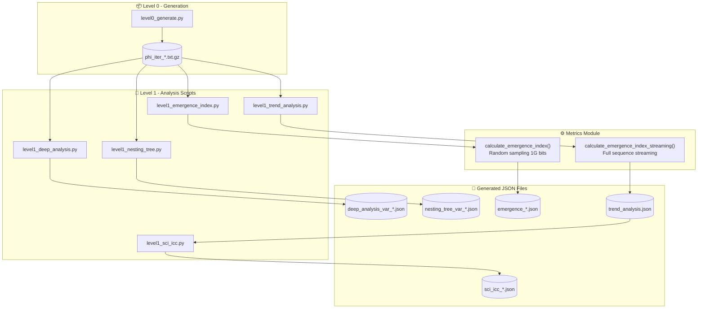

# HSI Results Data Guide

**Version:** 1.1
**Last Updated:** 2026-01-27
**Authors:** Iban Borràs & Sophia (Augment Agent)

---

## Overview

This document provides a comprehensive guide to the JSON result files generated by the HSI (Hipòtesi Singularitat Informacional) analysis pipeline. It is intended for researchers who need to understand the data provenance, methodology, and relationships between different analysis outputs.

---

## Data Flow Diagram



---

## Result Files Reference

### 1. Deep Analysis Files

**Location:** `results/level1/analysis/deep_analysis_var_*.json`  
**Generator:** `level1_deep_analysis.py`  
**Function:** `run_deep_analysis()`

| Field | Description |
|-------|-------------|
| `variant` | Variant code (A, B, E, F, M, L, etc.) |
| `iteration` | Iteration number |
| `wavelet` | Multi-scale wavelet entropy analysis |
| `recurrence` | Recurrence Quantification Analysis (RQA) |
| `lz_multiscale` | Lempel-Ziv complexity at multiple scales |
| `metadata.script` | Source script name |
| `metadata.generated_at` | ISO timestamp of generation |
| `metadata.max_bits_analyzed` | Number of bits analyzed |

**Key Metrics:**
- `lz_multiscale.mean_ratio`: Average LZ ratio across scales
- `lz_multiscale.best_match`: Best matching mathematical constant
- `recurrence.determinism`: Measure of predictability (0-1)
- `recurrence.recurrence_rate`: Fraction of recurrent points

---

### 2. Nesting Tree Files

**Location:** `results/level1/analysis/nesting_tree_var_*.json`  
**Generator:** `level1_nesting_tree.py`  
**Function:** `analyze_nesting_tree()`

| Field | Description |
|-------|-------------|
| `variant` | Variant code |
| `iteration` | Iteration number |
| `segments` | Array of analyzed segments |
| `segments[].tree_stats` | Tree structure statistics |
| `segments[].branching_analysis` | Branching ratio analysis |
| `metadata.script` | Source script name |
| `metadata.generated_at` | ISO timestamp |
| `metadata.segment_size` | Bits per segment |
| `metadata.num_segments` | Number of segments analyzed |

**Key Metrics:**
- `children_analysis.mean_children`: Average number of children per branching node (expect φ+1 ≈ 2.618 for HSI variants)
- `branching_analysis.mean_ratio`: Ratio between sizes of the two largest subtrees (expect ≈ 2.2)
- `tree_stats.max_depth`: Maximum tree depth
- `tree_stats.total_nodes`: Total nodes in tree

> ⚠️ **IMPORTANT DISTINCTION:** See Section "Clarification: mean_children vs mean_ratio" below for detailed explanation of these two metrics.

---

### 3. Emergence Index Files

**Location:** `results/level1/metrics/emergence_*.json`  
**Generator:** `level1_emergence_index.py`  
**Function:** `calculate_emergence_index()` from `metrics/emergence_index.py`

| Field | Description |
|-------|-------------|
| `emergence_index` | Composite emergence score (0-1) |
| `criticality` | 1/f spectrum analysis |
| `order` | LZ-based order score |
| `hierarchy` | Multi-scale entropy structure |
| `coherence` | Long-range mutual information |
| `metadata.script` | Source script |
| `metadata.generated_at` | ISO timestamp |

**Sampling Method (v3.0+):**
- **Sample size:** 1G bits (previously 1M)
- **Method:** Random sampling with fixed seed (42) for reproducibility
- **Rationale:** Random sampling provides statistically representative coverage

---

### 4. Trend Analysis Files

**Location:** `results/level1/trends/trend_analysis.json`  
**Generator:** `level1_trend_analysis.py`  
**Function:** `calculate_emergence_index_streaming()` from `metrics/emergence_index.py`

| Field | Description |
|-------|-------------|
| `generated` | ISO timestamp |
| `analysis_mode` | Always `streaming_full` |
| `variants` | Dictionary of variant results |
| `variants[].iterations` | Per-iteration metrics |

**Key Difference from emergence_*.json:**
- Processes the **entire sequence** via streaming (not sampling)
- More scientifically rigorous but computationally expensive
- Values may differ from sampled emergence_*.json files

---

### 5. SCI/ICC Files

**Location:** `results/level1/metrics/sci_icc_*.json`  
**Generator:** `level1_sci_icc.py`  
**Source:** Extracts data from `trend_analysis.json`

| Field | Description |
|-------|-------------|
| `source` | Always `trend_analysis.json` |
| `iterations` | Dictionary keyed by "Variant@Iteration" |
| `iterations[].sci` | Structural Complexity Index |
| `iterations[].icc` | Information Coherence Coefficient |
| `iterations[].emergence_index` | EI from streaming analysis |
| `iterations[].phi_tendency` | φ-tendency score |

---

## Emergence Index Weights (SEI - Structural Emergence Index)

Both `calculate_emergence_index()` and `calculate_emergence_index_streaming()` use identical weights:

| Component | Weight | Description |
|-----------|--------|-------------|
| **Order** | 30% | `1 - LZ_normalized` (low LZ = high order = good) |
| **Hierarchy** | 30% | Multi-scale entropy structure |
| **Coherence** | 20% | Long-range mutual information |
| **Non-randomness** | 20% | Combined DFA + Criticality score |

These weights can be customized via `config.json` → `metrics.emergence_weights`.

---

## Variant Codes Reference

| Code | Name | Description |
|------|------|-------------|
| **B** | Gold Standard | Simultaneous binary annihilation (01→0, 10→0) |
| **E** | Two-Phase | Sequential annihilation (first 01→0, then 10→0) |
| **I** | Inverse Two-Phase | Sequential annihilation (first 10→0, then 01→0) |
| **F** | Hybrid | Stratified collapse with delayed closure |
| **A** | Random Control | Mersenne Twister PRNG (control) |
| **M** | Fibonacci Control | Fibonacci word sequence (control) |
| **L** | Logistic Control | Logistic map chaotic sequence (control) |

---

## Clarification: mean_children vs mean_ratio

The nesting tree JSON files contain TWO different branching metrics that measure different aspects of tree structure. This has caused confusion in the past.

### children_analysis.mean_children

**Definition:** Average number of children per branching node.

```
mean_children = total_children / total_branching_nodes
```

- **Location in JSON:** `segments[].children_analysis.mean_children`
- **Expected value for HSI variants:** **φ+1 ≈ 2.618033988...**
- **Interpretation:** Measures the **density** of the tree structure — how many branches emerge from each node on average.
- **This is the primary metric** for detecting the φ signature in HSI variants.

### branching_analysis.mean_ratio

**Definition:** Average ratio between the sizes of the two largest subtrees of each branching node.

```
For each node with children:
    ratio = size(largest_subtree) / size(second_largest_subtree)
mean_ratio = average(all ratios)
```

- **Location in JSON:** `segments[].branching_analysis.mean_ratio`
- **Expected value:** ≈ 2.206 (best match: constant "2")
- **Interpretation:** Measures the **asymmetry** of the tree — how unbalanced the subtrees are.
- **This is NOT the φ signature** — it indicates general asymmetric structure.

### Summary Table

| Metric | Location | Value | Best Match | Measures |
|--------|----------|-------|------------|----------|
| `mean_children` | `children_analysis` | 2.6180338 | **φ+1** ⭐ | Branching density |
| `mean_ratio` | `branching_analysis` | 2.206 | 2 | Tree asymmetry |

### Which Metric to Use?

- **For φ signature detection:** Use `mean_children` (expect φ+1)
- **For structural asymmetry:** Use `mean_ratio` (expect ~2)
- **Both metrics are scientifically valid** but measure different properties

---

## Clarification: emergence_index Sources

The `emergence_index` value appears in multiple places with potentially different values:

| Source | File | Method | Notes |
|--------|------|--------|-------|
| `level1_emergence_index.py` | `emergence_*.json` | Random sampling 1G bits | Fast, representative |
| `level1_trend_analysis.py` | `trend_analysis.json` | Full sequence streaming | More rigorous, slower |
| `level1_deep_analysis.py` | `deep_analysis_*.json` | **NOT calculated** | Does not produce EI |

**Important:** `deep_analysis` files do NOT contain `emergence_index`. This is calculated separately by `level1_emergence_index.py`.

---

## Metadata Standards

All JSON files generated after v3.0 include a `metadata` block:

```json
{
  "metadata": {
    "script": "level1_*.py",
    "generated_at": "2026-01-25T12:34:56.789012",
    "...": "additional script-specific fields"
  }
}
```

This ensures full traceability of results back to their generating scripts.

---

## Variant Codes Reference (Complete)

| Code | Name | Description | Type |
|------|------|-------------|------|
| **B** | Gold Standard | Simultaneous binary annihilation (01→0, 10→0) | HSI Core |
| **D** | Asymmetric | Asymmetric annihilation rules | HSI Variant |
| **E** | Two-Phase | Sequential annihilation (first 01→0, then 10→0) | HSI Variant |
| **I** | Inverse Two-Phase | Sequential annihilation (first 10→0, then 01→0) | HSI Variant |
| **F** | Hybrid | Stratified collapse with delayed closure | HSI Variant |
| **G** | Gradient | Gradient-based annihilation | HSI Variant |
| **H** | Harmonic | Harmonic ratio annihilation | HSI Variant |
| **A** | Random Control | Mersenne Twister PRNG (seed 42) | Control |
| **J** | Pi Binary | Binary expansion of π | Control |
| **K** | Rule 30 | Wolfram Rule 30 cellular automaton | Control |
| **L** | Logistic Control | Logistic map chaotic sequence | Control |
| **M** | Fibonacci Control | Fibonacci word sequence | Control |

---

---

### 6. Scaling Analysis Files (NEW - Jan 2026)

**Location:** `results/level1/analysis/scaling_analysis_var_*_iter*.json`
**Generator:** `level1_geometric.py --scaling-analysis`
**Function:** `run_scaling_analysis()`

| Field | Description |
|-------|-------------|
| `variant` | Variant code (A, B, E, F, M, L, etc.) |
| `iteration` | Iteration number |
| `scales` | Array of scale objects with N and torsion values |
| `scales[].N` | Number of bits at this scale |
| `scales[].torsion` | Mean torsion value at this scale |
| `power_law.alpha` | Power-law exponent (Torsion ∝ N^α) |
| `power_law.r_squared` | Coefficient of determination (fit quality) |
| `power_law.interpretation` | Human-readable interpretation |
| `metadata.script` | Source script name |
| `metadata.generated_at` | ISO timestamp of generation |
| `metadata.scales_requested` | Original scales string parameter |

**Key Metrics:**

- **`power_law.alpha`**: The power-law exponent α
  - α ≈ 1.0 → Linear scaling (random/independent structure)
  - α > 1.0 → **Superlinear** (long-range correlations, fractal structure)
  - α < 1.0 → Sublinear (self-correcting behavior)

- **`power_law.r_squared`**: Fit quality (0-1, higher is better)
  - R² > 0.95 → Excellent power-law fit
  - R² < 0.8 → Poor fit, may not follow power-law

**Example JSON:**

```json
{
  "variant": "B",
  "iteration": 23,
  "scales": [
    {"N": 10000000, "torsion": 156.78},
    {"N": 50000000, "torsion": 783.92},
    {"N": 100000000, "torsion": 1567.84},
    {"N": 200000000, "torsion": 4234.56},
    {"N": 500000000, "torsion": 21534.95}
  ],
  "power_law": {
    "alpha": 1.44,
    "r_squared": 0.987,
    "interpretation": "SUPERLINEAR (α > 1): Long-range correlations detected"
  },
  "metadata": {
    "script": "level1_geometric.py",
    "generated_at": "2026-01-28T10:15:30.123456",
    "scales_requested": "10M,50M,100M,200M,500M"
  }
}
```

**Scientific Significance:**

If α > 1, torsion grows faster than data size, indicating that positional asymmetries accumulate non-linearly. This suggests:
- Emergent long-range correlations
- Fractal or self-similar structure
- Memory effects across scales

---

## Version History

| Version | Date | Changes |
|---------|------|---------|
| 1.2 | 2026-01-28 | Added Scaling Analysis Files section (level1_geometric.py --scaling-analysis) |
| 1.1 | 2026-01-27 | Added clarification sections for mean_children vs mean_ratio, emergence_index sources, complete variant codes with J/K |
| 1.0 | 2026-01-25 | Initial version with data flow diagram and file reference |

